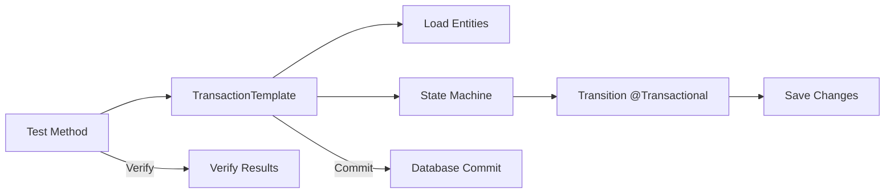

# Investigation Summary

### Overview
The user is asking for clarification on JPA entity detachment within the `RemoveLinkTransition` class, specifically regarding the `getOrCreateItem()` method, and seeking a strategy for transactional testing that allows verifying committed data.

### Findings
1.  **Detachment in Tests**: In `StateMachineRemoveLinkTransitionTest`, entities are detached because the test class is not `@Transactional`. The repository call to load entities happens in a separate transaction from the transition execution, leading to a closed session in between.
2.  **Transactional Context**: `RemoveLinkTransition` is annotated with `@Transactional`. By default, it uses `Propagation.REQUIRED`.
3.  **Production Behavior**: When called from a `@Transactional` service (like `BaseShoppingListService`), the transition joins the existing transaction. If the entity was loaded within that transaction, it remains attached.
4.  **Testing Strategy**: To test the "attached" scenario while ensuring data is committed for verification:
    *   **Self-invocation Pitfall**: Adding a `@Transactional` method to the test class itself won't work due to Spring's proxy-based AOP.
    *   **`TransactionTemplate`**: Provides a clean way to wrap specific blocks in a committing transaction.
    *   **Transactional Helper**: A separate `@Component` can be used to wrap logic in a transaction.

### Conclusion
The entity is detached in the test due to the lack of a shared transactional context, but it will remain attached in a standard production flow where the caller is also transactional. To verify this behavior in tests while ensuring data is committed, using `TransactionTemplate` or a separate transactional helper is recommended.

# Technical Design: Transactional Testing Strategy

### Current Implementation
`StateMachineRemoveLinkTransitionTest` is a `SpringBootTest` that loads data and calls the state machine. Each operation currently runs in its own transaction because the test class is not `@Transactional`.

### Proposed Changes
To allow testing the "attached" state while ensuring database commit:

#### Option 1: TransactionTemplate (Recommended)
Inject `PlatformTransactionManager` into the test and use `TransactionTemplate` to wrap the setup and the method under test.

```java
@Autowired
private PlatformTransactionManager transactionManager;

public void testMethod() {
    new TransactionTemplate(transactionManager).executeWithoutResult(status -> {
        // 1. Load entities
        // 2. Call transition (entities remain attached)
    });
    // 3. Verify results outside of the transaction
}
```

#### Option 2: Transactional Test Helper
Create a utility component in the test source folder.

```java
@Component
public class TransactionalTestHelper {
    @Transactional
    public void run(Runnable runnable) { runnable.run(); }
}
```

### Architecture Diagram


# Delivery Steps

### ✓ Step 1: Investigate Transactional Context
Investigate the codebase to understand the relationship between `AbstractTransition`, `RemoveLinkTransition`, and `ItemStateContext`.
- Identify the transactional boundaries of these classes.
- Examine how entities are loaded and passed to the state machine in both tests and production code.

### ✓ Step 2: Answer Technical Question and Design Testing Strategy
Provide a detailed answer to the user's question and a design for transactional testing.
- Explain why the item is detached in the test environment.
- Explain how transaction propagation (REQUIRED) affects the entity state in a production transactional context.
- Propose `TransactionTemplate` or a helper component as a solution for verifying committed data while keeping entities attached.

### ✓ Step 3: Implement Transactional Testing Strategy
Implement the `TransactionTemplate` approach in `StateMachineRemoveLinkTransitionTest` to verify that entities remain attached when executed within a transactional context.
- Inject `PlatformTransactionManager`.
- Wrap the setup and transition execution in a `TransactionTemplate`.
- Verify the results outside the transaction block.